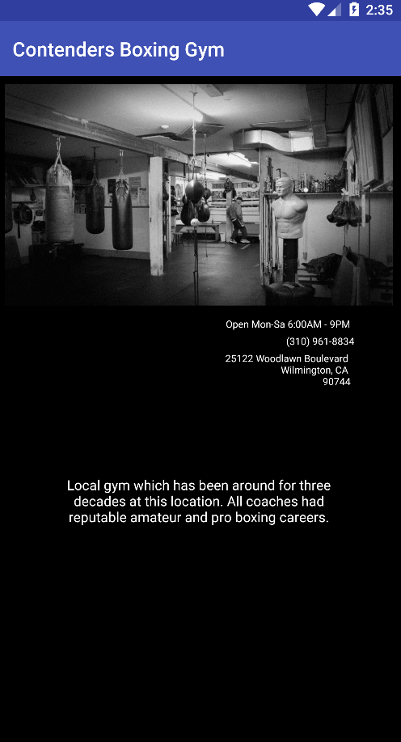

## Single Screen App

### Synopsis
This is the first project in Udacity's Android Basics Nanodegree. For this project, I created a very basic app for a fictional boxing gym in my area. The app shows a picture of the gym, contact information, a description of the gym, and hours of operation.

### Concepts and Technologies Used
- Java
- XML
- Working with a ViewGroup
- Android development best practices
    - sp for font size
    - dp for sizing
    - using xml files to reference strings instead of hardcoding

### Screenshot

